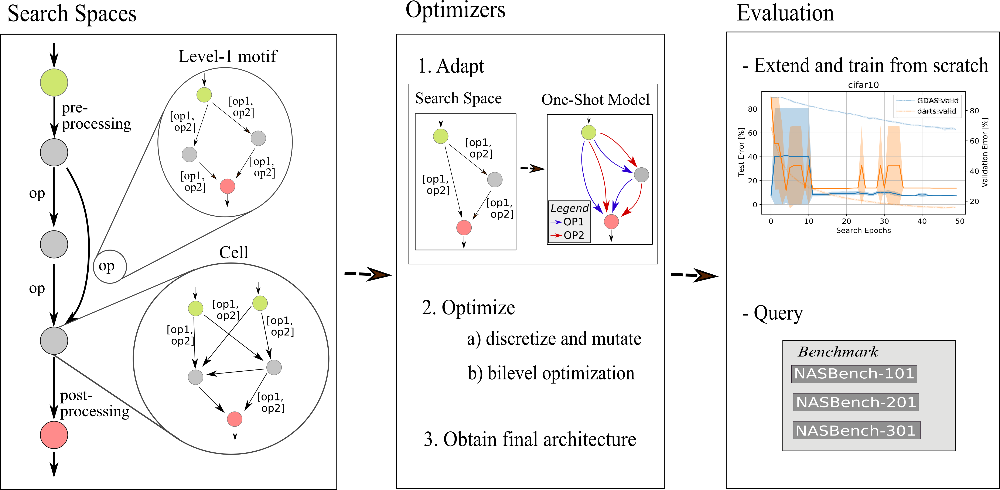

.. Sphinx documentation NASLib documentation master file, created by
   sphinx-quickstart on Mon Jul  5 20:39:23 2021.
   You can adapt this file completely to your liking, but it should at least
   contain the root `toctree` directive.

Documentation NASLib!
=======================================================
NASLib is a Neural Architecture Search (NAS) library. Its purpose is to facilitate NAS research for the community by providing interfaces to several state-of-the-art NAS search spaces.

.. warning::
   This library is under construction and there is no official release yet. Feel free to play around and have a look but be aware that the APIs will be changed until we have a first release.

NASLib has been used to run an extensive comparison of 31 performance predictors. The results were published in the paper How Powerful are Performance Predictors in Neural Architecture Search?
For more details take a look at its seperate README.

..
   :width: 200px
   :height: 100px
   :scale: 50 %
   :alt: alternate text
   :align: right

.. toctree::
   :maxdepth: 2
   :caption: Online Documentation Contents:

   example
   manual
   license
   citing
   contributing

..
   Indices and tables
   ==================

   * :ref:`genindex`
   * :ref:`modindex`
   * :ref:`search`

